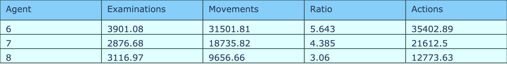
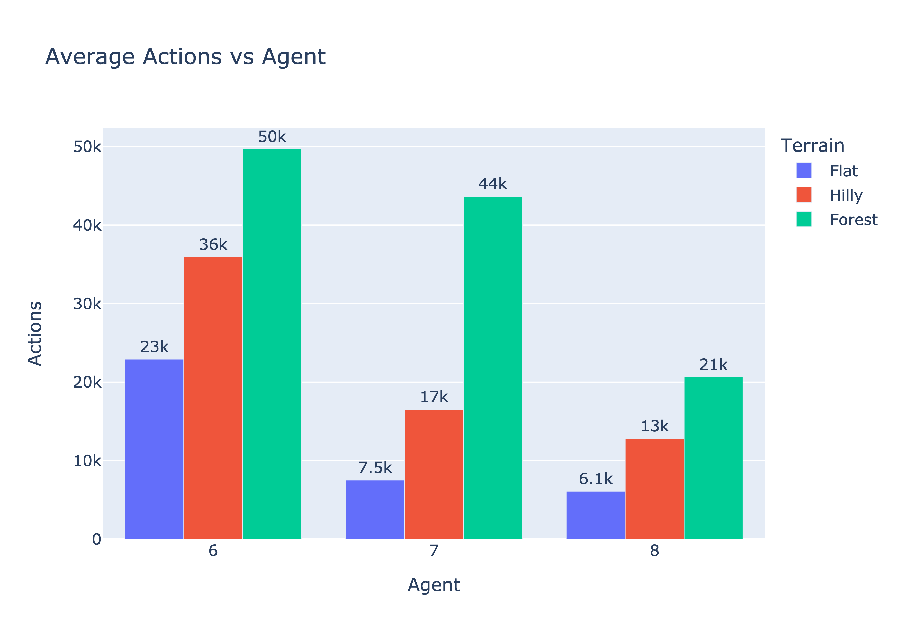

# Probabilistic Sensing
### Advith Chegu (ac1771) & Naveenan Yogeswaran (nry7)
### Both group members contributed equally to the code, data collection, and report.

**Prior to any interaction with the environment, what is the probability of the target being in a given cell?**

Prior to any interaction with the environment, each cell should have equal probabilty of containing the target.
Given the dimension for the grid D, the probability for each cell is $1/(D^2)$.

**Let $P_{i,j}(t)$ be the probability that cell $(i,j)$ contains the target, given the observations collected up to time t. At time $t+1$, suppose you learn new information about cell $(x,y)$. Depending on what information you learn, the probability for each cell needs to be updated. What should the new $P_{i,j}(t+1)$ be for each cell $(i,j)$ under the following circumstances:**

- At time t + 1 you attempt to enter $(x,y)$ and find it is blocked?

    $P_{i,j}(t + 1)$

    = $P(\text{in (i,j) | not (x,y)})$

    = $P(\text{in (i,j) and not (x,y)}) / P(\text{not (x,y)})$

    Because the target can only be in one cell, we know $P(in (i,j) and not (x,y))$ is the same as $P(in (i,j))$.

    = $P(\text{in (i,j)}) / P(\text{not (x,y)})$

    = $P_{i,j}(t) / (1 - P_{x,y}(t))$

    **Answer:** For every cell except (x,y), $P_{i,j}(t + 1)$ = $P_{i,j}(t) / (1 - P_{x,y}(t))$

    For cell (x,y), $P_{x,y}(t + 1)$ = 0

- At time t + 1 you attempt to enter $(x,y)$, find it unblocked, and also learn its terrain type?

    $P_{i,j}(t + 1)$

    = $P_{i,j}(t)$

    **Answer:** $P_{i,j}(t + 1)$ = $P_{i,j}(t)$

- At time t + 1 you examine cell $(x,y)$ of terrain type flat, and fail to find the target?

    $P(\text{failed at (x,y)})$

    = $P(\text{failed at (x,y) and in (x,y)}) + ∑_{i,j} P(\text{failed at (x,y) and in (i,j)})$

    = $P(\text{in (x,y)}) * P(\text{failed at (x,y) | in (x,y)}) + ∑_{i,j} P(\text{in (i,j)}) * P(\text{failed at (x,y) | in (i,j)})$

    Because the target can only be in one cell, we know $P(failed at (x,y) | in (i,j))$ is $1$.

    = $P(\text{in (x,y)}) * 0.2 + ∑_{i,j} P(\text{in (i,j)}) * 1$

    = $P(\text{in (x,y)}) * 0.2 + (1 - P(\text{in (x,y)}))$

    = $P_{x,y}(t) * 0.2 + (1 - P_{x,y}(t))$

    New probability for every cell except (x,y).

    $P_{i,j}(t + 1)$

    = $P(\text{in (i,j) | failed at (x,y)})$

    = $P(\text{in (i,j) and failed at (x,y)}) / P(\text{failed at (x,y)})$

    = $(P(\text{in (i,j)}) * P(\text{failed at (x,y) | in (i,j)})) / P(\text{failed at (x,y)})$

    Because the target can only be in one cell, we know $P(failed at (x,y) | in (i,j))$ is $1$.

    = $(P(\text{in (i,j)}) * 1) / P(\text{failed at (x,y)})$

    = $P(\text{in (i,j)}) / P(\text{failed at (x,y)})$

    = $P_{i,j}(t) / (P_{x,y}(t) * 0.2 + (1 - P_{x,y}(t)))$

    New probability for cell (x,y)

    $P_{x,y}(t + 1)$

    = $P(\text{in (x,y) | failed at (x,y)})$

    = $P(\text{in (x,y) and failed at (x,y)}) / P(\text{failed at (x,y)})$

    = $(P(\text{in (x,y)}) * P(\text{failed at (x,y) | in (x,y)})) / P(\text{failed at (x,y)})$

    = $(P(\text{in (x,y)}) * 0.2) / P(\text{failed at (x,y)})$

    = $(P_{x,y}(t) * 0.2) / (P_{x,y}(t) * 0.2 + (1 - P_{x,y}(t)))$

    **Answer:** For every cell except (x,y), $P_{i,j}(t + 1)$ = $P_{i,j}(t) / (P_{x,y}(t) * 0.2 + (1 - P_{x,y}(t)))$.

    For cell (x,y), $P_{x,y}(t + 1)$ = $(P_{x,y}(t) * 0.2) / (P_{x,y}(t) * 0.2 + (1 - P_{x,y}(t)))$.

- At time t + 1 you examine cell $(x,y)$ of terrain type hilly, and fail to find the target?
  
    **Answer:** For every cell except (x,y), $P_{i,j}(t + 1)$ = $P_{i,j}(t) / (P_{x,y}(t) * 0.5 + (1 - P_{x,y}(t)))$.

    For cell (x,y), $P_{x,y}(t + 1)$ = $(P_{x,y}(t) * 0.5) / (P_{x,y}(t) * 0.5 + (1 - P_{x,y}(t)))$.

- At time t + 1 you examine cell $(x,y)$ of terrain type forest, and fail to find the target?
  
    **Answer:** For every cell except (x,y), $P_{i,j}(t + 1)$ = $P_{i,j}(t) / (P_{x,y}(t) * 0.8 + (1 - P_{x,y}(t)))$.

    For cell (x,y), $P_{x,y}(t + 1)$ = $(P_{x,y}(t) * 0.8) / (P_{x,y}(t) * 0.8 + (1 - P_{x,y}(t)))$.

- At time t + 1 you examine cell $(x,y)$ and find the target?

    **Answer:** For every cell except (x,y), $P_{i,j}(t + 1)$ = $0$.

    For cell (x,y), $P_{x,y}(t + 1)$ = $1$.

**At time t, with probability $P_{i,j}(t)$ of cell $(i,j)$ containing the target, what is the probability of finding the target in cell $(x,y)$:**

- If $(x,y)$ is hilly?

    $P(\text{finding target in (x,y)})$

    = $P(\text{in (x,y) and finding in a hilly terrain})$ ← These two are independent events

    = $P(\text{in (x,y)}) * P(\text{finding in hilly terrain})$

    = $P_{x,y}(t) * (1 - 0.5)$

    = $P_{x,y}(t) * 0.5$

    **Answer:** $P_{x,y}(t) * 0.5$

- If $(x,y)$ is flat?

    $P(\text{finding target in (x,y)})$

    = $P(\text{in (x,y) and finding in a flat terrain})$ ← These two are independent events

    = $P(\text{in (x,y)}) * P(\text{finding in flat terrain})$

    = $P_{x,y}(t) * (1 - 0.2)$

    = $P_{x,y}(t) * 0.8$

    **Answer:** $P_{x,y}(t) * 0.8$

- If $(x,y)$ is forest?

    $P(\text{finding target in (x,y)})$

    = $P(\text{in (x,y) and finding in a forest terrain})$ ← These two are independent events

    = $P(\text{in (x,y)}) * P(\text{finding in forest terrain})$

    = $P_{x,y}(t) * (1 - 0.8)$

    = $P_{x,y}(t) * 0.2$

    **Answer:** $P_{x,y}(t) * 0.2$

- If $(x,y)$ has never been visited?

    $P(\text{finding target in (x,y)})$

    = $P(\text{in (x,y) and finding in an unknown terrain})$ ← These two are independent events

    = $P(\text{in (x,y)}) * P(\text{finding in unknown terrain})$

    = $P(\text{in (x,y)}) * (P(\text{finding in terrain and terrain is blocked}) + P(\text{finding in terrain and terrain is flat}) + P(\text{finding in terrain and terrain is hilly}) + P(\text{finding in terrain and terrain is forest}))$

    = $P(\text{in (x,y)}) * (P(\text{terrain is blocked})*P(\text{finding in terrain | terrain is blocked}) + P(\text{terrain is flat})*P(\text{finding in terrain | terrain is flat}) + P(\text{terrain is hilly})*P(\text{finding in terrain | terrain is hilly}) + P(\text{terrain is forest})*P(\text{finding in terrain | terrain is forest}))$

    = $P(\text{in (x,y)}) * ((0.3) * (1-1) + (0.7) * ((1⁄3) * (1-0.2) + (1⁄3) * (1-0.5) + (1⁄3) * (1-0.8)))$

    = $P(\text{in (x,y)}) * (0.7) * ((1⁄3) * 1.5)$

    = $P(\text{in (x,y)}) * (0.7) * 0.5$

    = $P_{x,y}(t)*0.35$

    **Answer:** $P_{x,y}(t) * 0.35$

**Implement Agent 6 and 7. For both agents, repeatedly run each agent on a variety of randomly generated boards (at constant dimension) to estimate the number of actions (movement + examinations) each agent needs on average to find the target. You will need to collect enough data to determine which of these agents is superior. Do you notice anything about the movement/examinations distribution for each agent? Note, boards where the target is unreachable from the initial agent position should be discarded.**

The following tables and graphs are based off the data collected by running each agent on 100 different 50x50 gridworlds.

As shown in the table above, we can see that Agent 7 is superior over Agent 6 as Agent 7 performs less actions on average than Agent 6. This is likely because Agent 7 takes the terrain type and their false negative rates into consideration when deciding which cell to examine next. As a result, Agent 7 will prioritize cells where it'll likely find the target over cells that just may contain the target.

As shown in the bar graph above, both Agents seem to take more actions as the false negative rate increases which makes sense as higher false negative rates increases the chances of failing an examination which increases the number of actions needed to reexamine the cell later. Agent 7 seems to still consistently beat Agent 6 among the various terrain types as well. Although Agent 7 does struggle more when the target is in a forest, the way the agent prioritizes finding the cell allowed it to still beat Agent 6 on average for every terrain.

From the graphs above and the table in the beginning of this question, we see that the movement/examination ratios for Agent 7 were typically more smaller than the movement/examination ratios of Agent 6 (on average, Agent 7 had a ratio of 4.48, compared to Agent 6 with an average ratio of 5.64). This may likely be due to Agent 7 being able to stop and replan after learning the false negative rate of its current cell which could've changed the cell with the highest probability of finding the target. As a result, we end up with less movements and more examinations compared to Agent 6. The box plot below also shows that the spread of the ratios for 7 is generally less than the spread for Agent 6.

Overall, we can observe from this data that Agent 7 is superior over Agent 6.

**Describe your algorithm, be explicit as to what decisions it is making, how, and why. How does the belief state $(P_{i,j}(t))$ enter into the decision making? Do you need to calculate anything new that you didn't already have available?**

Like the initial two agents, agent 8 roughly follows the same process. It first makes a guess as to where the target is on the board and uses repeated A* to work its way towards it. 

We first decided to start building Agent 8 from Agent 7 because we noticed that our Agent 7 was able to find the target in less actions than Agent 6 on average.

Once it reaches the first guess, it attempts to look for the target. Each square in the grid has a varying false negative rate depending on the type of terrain. If the target does not exist in the first guess or if the search returns a false negative, we make decisions that differs from Agent 7.

First, we calculate a *utility* value to determine which cell to examine next. This utility value is determined using the probability of finding the target and the manhattan distance from the target. As the probability of finding the target increases, our utility value will increase. However, as the manhattan distance from our current cell increases, our utility value for that cell will decrease. We chose to use this utility value as we don't want to disregard promising cells that are close by just because they don't happen to have the highest probability of finding the target. This way, we can examine closer cells that also have a reasonably high probability of finding the target. This should lower our number of movements as we may find the target in these closer cells which lessens the number of movements incase we go to farther cells and have to come back after examining those farther cells. We use the following formula to determine the utility value of a cell:
  - $value_{i,j} = p(finding in (i,j)) - dist(agent, (i,j)) * (\frac{1}{dim^2}) * 0.01$

We first normalize the distance value by dividing it by the total size of the grid. This way, we won't severely limit the distance we're willing to travel to a cell with the highest probability of finding the target. For example, in larger grid sizes, the manhattan distance to a promising cell will be large and could be bad for the utility value if we don't normalize the distance. And thus, we divide the manhattan distance by the size of the grid to prevent this issue. We then multiply the distance with an additional 0.01 to further avoid that issue of large distances being too punishing. Now that we determined the utility value of the cells, we pick the cell with the greatest utility value.

Next, in the event that there is a tie for the highest utility value, we look at the surroundings of all of the tied cells. We do this by summing the probability of finding the target in the neighbors of the tied cells. Whichever cell has the highest sum is then chosen as the next cell to examine. We do this in order to go to an area with high probabilties of finding the cell as this should increase our chances of finding the target without having to move much more incase the cell we examined failed.

Lastly, during execution of our path to the cell with the highest utilty value, we also examine cells along the path that also have a relatively high probability of finding the target. We determine this by seeing if that cell has a finding probability that is at least 0.8 * the finding probability of the cell with the highest utility value. This way, we can check reasonable cells along the way without having to perform A* and execute a path towards that cell later on. We chose the value 0.8 as we want to be open to more cells along the path; however, we don't want to examine too many cells along the path if their finding probability isn't reasonably high compared to the cell with the highest utility.

The belief state $(P_{i,j}(t))$ enters into our decision making when we are determining the utlity value of a cell, finding cells in areas with higher probabilities, and when deciding to examine cells along the path. This is because we rely on the probability of finding the cell to make these decisions as described above.

We don't need to calculate anything new that isn't already availaible to us as we use the same probabilities and manhattan distances that we used in Agent 6 and 7. All we do in Agent 8 is use these values in different ways to calculate the utility value of examining a cell to see if that cell is reasonable to examine.

**Implement Agent 8, run it sufficiently many times to give a valid comparison to Agents 6 and 7, and verify that Agent 8 is superior.**

From the graphs, we can observe that as the false negative rates of the terrains increases, the amount of actions taken by Agent 8 also increases. This makes sense as a higher false negative rate means the chance of failing an examination at the target cell increases, which leads to more actions needed to eventually reexamine the target cell.

However, we also observe the Agent 8 is still able to outperform both Agents 6 and 7 as Agent 8 took fewer actions to find the target. We see this trend among all the terrain types for the target.
This is because Agent 8 fixes some of the weaknesses found in Agents 6 and 7.

The weakness Agents 6 and 7 suffers from is that they ignore close cells that also have reasonably high probabilities. By doing this, these Agents will end up having to travel back and forth to examine cells which increases number of movements. Agent 8 fixes this using the various strategies described earlier. By considering closer cells with reasonably high probabilities using utlity values, Agent 8 was able to cut down on the number of movements by finding the target earlier.

We also observe that the movement/examination ratio is smaller for Agent 8. This makes sense as we sacrifice a lot of movement for more examinations in our strategies. By taking the chance to examine closer cells with reasonably high probabilities, we increase the number of examinations, but significantly decrease the number of movements. This allows for a smaller ratio in Agent 8 compared to Agents 6 and 7.

The above graph also shows that the distribution of the ratios for Agent 8 is also more compact and less spread apart compared to Agents 6 and 7.

Overall, our data supports that Agent 8 is superior to Agents 6 and 7.

**How could you improve Agent 8 even further? Be explicit as to what you could do, how, and what you would need.**

One way we could improve Agent 8 further is by adjusting the way we plan our paths. Rather than planning a path towards one cell with the highest utility value, we could have our planning phase plan an optimized path to visit the 5 cells with the highest utility value. By planning a path to one cell at a time, we may not be able to visit the top 5 cells with the highest utility value in the most optimized path. For example, traversing to the second highest utility value cell then to the first may require less movements than traversing to the highest utility value cell then to the second.

To do this, we would first need to keep track of the five cells with the highest utility values. This could be done by keeping a list that keeps track of these top five values as we update probabilities. We would then use our A* planning method to try out the different orderings of these five cells to see which sequences of paths sums up to the shortest among those orderings. We can then traverse the shortest path among the different orderings of these top 5 cells. This should lower the number of movements we make with the agent while also examining the top cells which may likely contain the target.

